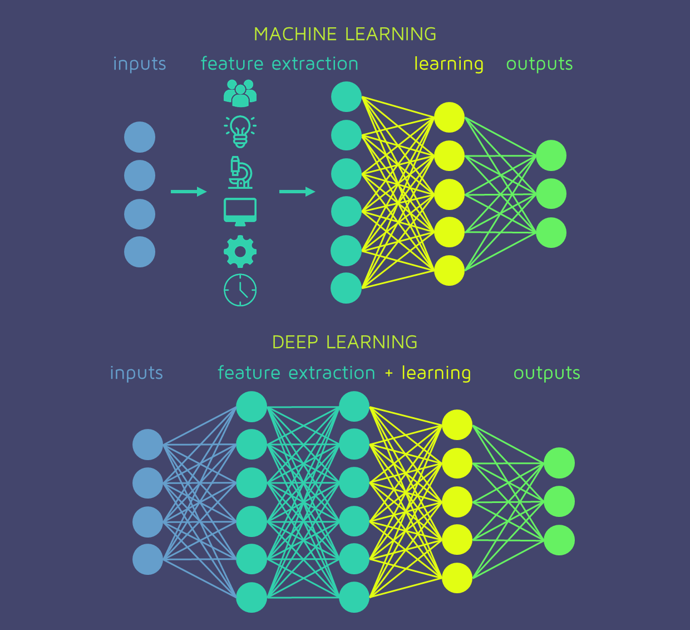

```{r include = F}
library(tidyverse)
library(xaringan)
library(xaringanthemer)
library(kableExtra)
library(DT)
```

class: title-slide
background-image: url(images/logo_chaire.jpg), url(images/background.jpg)
background-size: 30%, cover
background-position: 98% 98%, center

.titre-page-titre[Introduction à l'apprentissage profond]
<br />
.sous-titre-page-titre[Modèles actuariels en assurance non-vie]
<br />
<br />
***
<br />
<br />
.sous-sous-titre-page-titre[.mon-style-bleu[par] Francis Duval <br /> .mon-style-bleu[à] l'Université du Québec à Montréal <br /> .mon-style-bleu[le] 14 mars 2023]

---

# Qu'est-ce que l'apprentissage profond?

```{r echo = F, out.width = "95%", fig.align = "center"}

```

- L'apprentissage profond est la grande majorité du temps effectué avec des .gras-bleu[réseaux de neurones profonds], c'est-à-dire des réseaux de neurones avec plusieurs couches cachées.

???

**Intelligence**
- La capacité de traiter l'information pour éclairer les décisions futures ou pour effectuer des tâches

**Intelligence artificielle**
- Algorithme qui essaie d'imiter l'intelligence humaine.

**Machine learning**
- Apprendre à un algorithme comment résoudre la tâche sans être explicitement programmé pour le faire.

**Apprentissage profond**
- Machine learning qui va encore plus loin et qui va extraire automatiquement l'information utile à partir des données brutes.

---

# Pourquoi l'apprentissage profond?

```{r echo = F, out.width = "100%", fig.align = "center"}

```

???

- En machine learning, on donne habituellement en entrée au modèle des features (ou variables explicatives) qui sont conçues « à la main » à partir des données brutes.
- Les GLMs sont un exemple d'algorithme de machine learning.
- Par exemple, en assurance automobile, on va définir un ensemble de features qu'on va donner en entrée au modèle: âge, sexe, région, marque de voiture, échelle bonus-malus, etc.
- Le machine learning permet de résoudre une grande variété de tâches, mais peut ne pas être apte à des tâches plus complexes dans lesquelles la création de features à partir des données brutes n'est pas simple.
- Par exemple, en détection de visages, où les données brutes sont des pixels, ce ne serait pas clair quelles transformations il faut faire avant de les donner en entrée à notre GLM pour que celui-ci soit capable de reconnaître un visage. 
- On pourrait lui dire « si tu vois une bouche et un nez, c'est probablement un visage ». Mais comment extraire les features « bouche » et « nez » à partir des pixels?
- La bonne manière d'approcher ce type de problème est d'utiliser un réseau de neurones, qui va apprendre lui-même des features à partir des données brutes, et ce de manière hiérarchique.
- Par exemple, les premières couches cachées vont apprendre les caractéristiques de bas niveau de visages, c'est-à-dire des lignes.
- Les couches intermédiaires vont apprendre des caractéristiques de plus haut niveau, comme des nez et des yeux.
- Finalement, la dernière couche apprend des caractéristiques de haut niveau, ici des visages complets.

---

# Pourquoi l'apprentissage profond?

## Exemple: on veut tarifer les assurés avec leurs données télématiques

.pull-left[
**Machine learning**
- On va extraire des features « à la main » à partir des données brutes. Par exemple:
  - nb. freinages brusques
  - nb. accélérations brusques
  - % conduite le jour/soir/nuit
  - vitesse moyenne
  - etc.
- On utilise ensuite ces features extraites « à la main » dans un algorithme de machine learning, comme un GLM. 
]

.pull-right[
**Deep learning**
- On donne typiquement les données sous un format plus brute à l'algorithme de deep learning. Par exemple, on pourrait lui donner:
  - les données de trajets seconde-par-seconde sous un certain format
  - les résumés de trajets sous un certain format
- Celui-ci va lui-même créer les features qu'il trouve pertinentes.
- Noter qu'il y a quand même un certain travail d'ingénierie de données à faire. Par exemple, il est peu probable qu'une date (stockée sous `R` en nombre de jours depuis 1970) soit pertinente pour la tarification.
]

---

# Pourquoi l'apprentissage profond?

.pull-left[
```{r echo = F, out.width = "100%", fig.align = "left"}

```
]

.pull-right[
<br>
<br>
<br>
<br>
## Machine learning 
<br>
## vs
<br>
## Deep learning
]

---

background-image: url("images/timeline.png")
background-position: 10% 50%
background-size: 25%

# Petit historique

.pull-right-65[
## Pourquoi maintenant?

1. **Données massives**
  - Plus facile de nos jours de collecter et stocker de grandes quantités de données.
2. **Hardware**
  - Puissance de calcul a beaucoup augmenté (et a diminué en prix) depuis quelques décennies.
  - GPUs (Graphics Processing Units)
3. **Software**
  - Nouveaux logiciels qui facilite l'implémentation de modèles de deep learning sont apparus:
    - Torch for `R`
    - PyTorch
    - TensorFlow
    - etc.
]

<br /><br /><br /><br /><br /><br /><br /><br /><br /><br /><br /><br /><br /><br /><br /><br /><br /><br />

- Aussi, plusieurs avancées théoriques depuis quelques décennies: **backpropagation**, résolution du **vanishing (ou exploding) gradient problem**, etc.


???

- Les réseaux de neurones existent depuis longtemps (plusieurs décennies).
- Pourquoi alors semblent-ils avoir subit une hausse de popularité dans les dernières années?
- Pour plusieurs raisons:
  - Plus de données qu'avant
  - Meilleurs ordinateurs
  - Nouveaux logiciels pour facilier l'implémentation
- Aussi:
  - Découverte de la rétro-propagation dans les années 80
  - Résolution du problème d'explosion et de « vanishing » du gradient dans les réseaux de neurones profonds.

---

# Qu'est-ce qu'un réseau de neurones (concrètement)?

## Perceptron

**Le perceptron est l'instance la plus simple d'un réseau de neurones. Il est en quelque sorte la « brique » qui permet de construire des réseaux de neurones plus complexes.**

```{r echo = F, out.width = "65%", fig.align = "center"}

```

???

- Donc un perceptron est une fonction qui va:
  - multiplier chaque input par un poids,
  - additioner les résultats des multiplications,
  - transformer le nombre obtenu avec une fonction d'activation.
- Noter que la fonction d'activation peut être la fonction identité, si notre output est élément des réels
- Si notre variable réponse est binaire, on peut utiliser la fonction d'activation sigmoide, et alors on obtient un perceptron qui est très similaire à la régression logistique.
- Si notre variable réponse est un nombre entier positif, on peut utiliser la fonction d'activation exponentielle, et alors on obtient un perceptron qui est très similaire à la régression Poisson.
- Note: on peut aussi voir la fonction de prédiction d'un perceptron comme le produit scalaire du vecteur d'inputs $\boldsymbol{x}$ avec le vecteur de poids $\boldsymbol{W}$, suivi de l'application de la fonction d'activation $g$.

---

# Qu'est-ce qu'un réseau de neurones (concrètement)?

## Exemple

- Un actuaire veut estimer la probabilité de réclamer pour des assuré.es en se basant sur 2 prédicteurs (inputs), c'est-à-dire l'**âge de l'assuré.e** et l'**âge de son véhicule**. 
- L'actuaire considère un perceptron avec une fonction d'activation **sigmoide**. Après avoir entrainé le perceptron sur une base de données, il obtient les poids suivants:
  - $w_0$ = -2, 
  - $w_{\texttt{age_ass}}$ = -0.02,
  - $w_{\texttt{age_veh}}$ = -0.01.

****
**Exercice**: Estimer la probabilité de réclamer pour un assuré de 25 ans avec un véhicule de 5 ans.

???

\begin{align*}
  \widehat{y} &= \frac{1}{1+e^{-(-2-0.02 \times 25 -0.01 \times 5)}}\\
  &= 0.07243
\end{align*}

---

# Qu'est-ce qu'un réseau de neurones (concrètement)?

## Ajout de couches cachées

- Un perceptron est bien, mais ne permet qu'une fonction de prédiction linéaire (par rapport aux inputs).
- Ajouter des couches cachées permet d'obtenir un fonction de prédiction bien plus flexible. Lorsqu'il y a au moins 1 couche cachée, on parle de **perceptron multicouches**.


### Exercice
- Aller sur le site [playground.tensorflow.org](https://playground.tensorflow.org).
- Entrainer un perceptron avec fonction d'activation **sigmoide** utilisant les 2 premiers inputs $x_1$ et $x_2$ sur le **premier jeu de données de classification**.
  - Remarquer que la fonction de prédiction obtenue est linéaire, alors que la tâche à effectuer ne l'est pas (c'est un cercle).    
- Ajouter $x_1^2$ et $x_2^2$ comme inputs et entrainer le modèle.
  - Le modèle est maintenant capable de bien séparer les 2 classes, sauf qu'il a fallu penser à créer les 2 nouveaux inputs $x_1^2$ et $x_2^2$.
- Utiliser seulement $x_1$ et $x_2$ comme inputs, mais ajouter une **couche cachée à 3 neurones**. Entrainer le modèle.
  - Le modèle a maintenant une fonction de prédiction plus raisonnable.

---

background-image: url("images/graphe_perceptron.png")
background-position: 80% 41%
background-size: 70%

# Qu'est-ce qu'un réseau de neurones (concrètement)?

### Perceptron multicouches (exemple à 1 couche cachée de 3 neurones cachés)

<br /><br /><br /><br /><br /><br /><br /><br /><br />

La fonction de prédiction peut être écrite sous forme matricielle: $\widehat{y} = g\left[\boldsymbol{w}^{(2)}\times g\left(\boldsymbol{w}^{(1)}\boldsymbol{x} + \boldsymbol{b}^{(1)}\right) + \boldsymbol{b}_1^{(2)}\right]$, où « $\times$ » est la multiplication matricielle standard et où:

\begin{align*}
  \boldsymbol{x} =  \begin{bmatrix} x_1\\x_2 \end{bmatrix}, \quad \boldsymbol{w}^{(1)} = \begin{bmatrix} w_{11}^{(1)} & w_{21}^{(1)}\\w_{12}^{(1)} & w_{22}^{(1)} \\ w_{13}^{(1)} & w_{23}^{(1)} \end{bmatrix}, \quad \boldsymbol{w}^{(2)} = \begin{bmatrix} w_1^{(2)} & w_2^{(2)} & w_3^{(2)} \end{bmatrix}, \quad \boldsymbol{b^{(1)}} = \begin{bmatrix} b_1^{(1)} & b_2^{(1)} & b_3^{(1)} \end{bmatrix}, \quad \boldsymbol{b}_1^{2} = \begin{bmatrix} b_1^{(2)} \end{bmatrix}.
\end{align*}

???

- Remarquer que la fonction de prédiction est déjà relativement complexe avec seulement une couche cachée de 3 neurones. 
- En effet, pour seulement 2 inputs, on a déjà 13 paramètres. C'est pour ça que les réseaux de neurones sont capables de résoudre des tâches complexes.
- La linéarité est brisée par les fonctions d'activation $g$. Sans celles-ci, la fonction de prédiction serait complètement linéaire.

---

# Entrainer un réseau de neurones

### Fonction de perte

- Entrainer le réseau = trouver de « bonnes » valeurs pour les paramètres $\boldsymbol{w}$ et $\boldsymbol{b}$.
- Bonnes valeurs de paramètres $\longrightarrow$ valeurs qui donnent des prédictions $\widehat{y}$ « proches » des réponses $y$.
- Pour définir « proche », on doit se choisir une **fonction de perte**.
- Exemples de fonctions de perte:
  - Erreur quadratique (pour $y \in \mathbb{R}$):
  \begin{align}
    \ell(y, \widehat{y}) = (y - \widehat{y})^2 
  \end{align}
  - Entropie croisée binaire (pour $y \in \{0, 1\}$):
  \begin{align}
    \ell(y, \widehat{y}) = \left[y \ln(\widehat{y}) + (1-y) \ln(1-\widehat{y})\right]
  \end{align}
  - Moins la log-vraisemblance Poisson pour données de comptage:
  \begin{align}
    \ell(y, \widehat{y}) = \left[-\widehat{y} + y\ln(\widehat{y})\right]
  \end{align}
- Le but est alors de minimiser la fonction de perte moyenne sur l'ensemble d'entrainement, qu'on appelle parfois **risque empirique**. On voudra donc trouver les paramètres qui minimisent $\frac{1}{n}\sum_{i=1}^n \ell(y_i, \widehat{y}_i)$.
$$\DeclareMathOperator*{\argmin}{argmin}$$

???

- Entrainer un réseau de neurones signifie trouver de bonnes valeurs pour ses paramètres.
- De bonnes valeurs de paramètres sont des valeurs qui mènent à des prédictions $\widehat{y}$ « proches » de la vraie valeur $y$.
- Pour définir « proche », on choisit une fonction de perte, qui mesure la distance entre une réponse $y$ et sa prédiction $\widehat{y}$.
- On vise à minimiser la fonction de perte moyenne prise sur toutes les observations de l'ensemble d'entrainement.

---

# Entrainer un réseau de neurones

### Minimisation du risque empirique

- Le but est donc de trouver les paramètres $\boldsymbol{w}^*$ qui minimisent le risque empirique:
\begin{align}
  \boldsymbol{w}^* &= \argmin_\boldsymbol{w} \frac{1}{n}\sum_{i=1}^n \ell(y, \widehat{y})\\
  &= \argmin_\boldsymbol{w} \frac{1}{n}\sum_{i=1}^n \ell(y, f(\boldsymbol{x}_i; \boldsymbol{w}))\\
  &= \argmin_\boldsymbol{w} J(\boldsymbol{w})
\end{align}

- Avec les GLMs, on dérivait par rapport aux paramètres et on égalait à zéro pour trouver le minimum.
- Cette méthode ne fonctionne pas ici, car rien ne garantit que la fonction de risque empirique $J$ est convexe!
- On utilise plutôt la **descente de gradient** (et ses dérivées).

???

- Le but est de trouver les paramètres $\boldsymbol{w}^*$ qui minimisent le risque empirique $J$.
- On ne peut pas simplement calculer la dérivée de la fonction $J$ par rapport aux paramètres $\boldsymbol{w}$ et égaler à zéro pour trouver le minimum comme on faisait avec les GLMs, car la fonction $J$ n'est jamais convexe (sauf peut-être dans quelques cas simples comme le perceptron à 0 couche cachée) et a souvent plusieurs minimums locaux et des points de selle.
- Pour les réseaux de neurones, on utilise donc habituellement des méthodes basées sur la descente de gradient. 

---

# Entrainer un réseau de neurones

### Descente de gradient

.pull-left[
```{r echo = F, out.width = "100%", fig.align = "center", fig.cap = "Fonction de risque empirique en fonction des paramètres. Note: ici, les paramètres sont dénotés par la lettre grecque theta."}

```
]

.pull-right[
**Pseudo-algorithme:**<br>
1. Initialiser les paramètres $(w_0, w_1)$ au hasard
2. Calculer le gradient de la fonction de risque au point $(w_0, w_1)$
3. Bouger dans la direction opposée du gradient (le gradient pointe vers le haut de la fonction alors qu'on veut aller vers le bas)
4. Répéter jusqu'à convergence
]

---

# Entrainer un réseau de neurones

### Descente de gradient

**Algorithme**

1. Initialiser les paramètres $\boldsymbol{w}$ au hasard $\sim\mathcal{N}(0, \sigma^2)$
2. Répéter jusqu'à convergence:
  - Calculer le gradient $\frac{\partial J(\boldsymbol{w})}{\partial \boldsymbol{w}}$
  - Mettre à jour les paramètres: $\boldsymbol{w} \leftarrow \boldsymbol{w} - \eta \frac{\partial J(\boldsymbol{w})}{\partial \boldsymbol{w}}$
3. Output: paramètres $\boldsymbol{w}$

---

# Entrainer un réseau de neurones

### Rétropropagation

- Algorithme de **différentiation automatique** pour calculer le gradient de la fonction de risque empirique.
- L'algorithme de rétropropagation utilise la **règle de dérivation en chaine** pour calculer le gradient, en allant de la fin du réseau jusqu'au début (d'où le « rétro »).

**Exemple**

- Si vous avez 500 paramètres (ce qui n'est pas énorme pour un réseau de neurones), le gradient sera un vecteur en 500 dimensions.
- La rétropropagation permet de calculer ce gradient compliqué de manière efficace.

**2 bonnes vidéos sur la rétropropagation:**

- [3Blue1Brown (sans formules)](https://www.youtube.com/watch?v=Ilg3gGewQ5U&t=18s)
- [3Blue1Brown (avec formules)](https://www.youtube.com/watch?v=tIeHLnjs5U8&t=484s)

???

- C'est important de distinguer la rétropropagation de la descente de gradient. La rétropropagation calcule le gradient, alors que la descente de gradient utilise le gradient calculé pour mettre à jour les paramètres.

---

# Entrainer un réseau de neurones

### Récapitulation

**Pour entrainer un réseau de neurones, on va:**

* .gras-bleu[Initaliser] les paramètres au hasard

- Faire une première « .gras-bleu[passe forward] » pour obtenir le risque empirique initial
- Appliquer la .gras-bleu[rétropropagation] pour calculer le gradient
- Effectuer la .gras-bleu[descente de gradient] pour mettre à jour les paramètres

* Faire une deuxième « .gras-bleu[passe forward] » pour obtenir la nouvelle valeur du risque empirique
* Appliquer la .gras-bleu[rétropropagation] pour calculer le nouveau gradient
* Effectuer la .gras-bleu[descente de gradient] pour mettre à jour les paramètres

- etc.

---

# Entrainer un réseau de neurones

### Récapitulation

```{r echo = F, out.width = "55%", fig.align = "left"}

```

---

# Autres types d'architectures

- Dans cette présentation, nous nous sommes concentrés sur le perceptron multicouches dans le cadre de l'apprentissage supervisé.
- Cependant, il existe une panoplie d'autres architecture.

```{r echo = F, out.width = "98%", fig.align = "left"}
knitr::include_graphics("images/neural_nets_types.png")
```

---

background-image: url("images/neural_nets_types.png")
background-position: 50% 40%
background-size: 86%

---

background-image: url("images/neural_nets_types.png")
background-position: 50% 99%
background-size: 90%

---

# Application - tarification avec données télématiques

### Données

| Véhicule | Numéro de trajet | Date-heure de départ | Date-heure d'arrivée | Distance | Vitesse maximale |
|------|:------:|------:|------:|------:|------:|
| A | 1 | 2017-05-02 19:04:15 | 2017-05-02 19:24:24 | 25 | 104 |
| A | 2 | 2017-05-02 21:31:29 | 2017-05-02 21:31:29 | 6.4 | 66 |
| $\vdots$ | $\vdots$ | $\vdots$ | $\vdots$ | $\vdots$ | $\vdots$ |
| A | 2320 | 2018-04-30 21:17:22 | 2018-04-30 21:18:44 | 0.2 | 27 |
| B | 1 | 2017-03-26 11:46:07 | 2017-03-26 11:53:29 | 1.5 | 76 |
| B | 2 | 2017-03-26 15:18:23 | 2017-03-26 15:51:46 | 35.1 | 119 |
| $\vdots$ | $\vdots$ | $\vdots$ | $\vdots$ | $\vdots$ | $\vdots$ |
| B | 1485 | 2018-03-23 20:07:08 | 2018-03-23 20:20:30 | 10.1 | 92 |
| $\vdots$ | $\vdots$ | $\vdots$ | $\vdots$ | $\vdots$ | $\vdots$ |

---

# Application - tarification avec données télématiques

### Problème

**Supposons que l'on veuille faire de la tarification par véhicule. On pourrait alors créer « à la main » plusieurs variables explicatives, ou features, avec les données télématiques. Par exemple:**
- Distance moyenne par jour
- Nombre de trajets moyen par jour
- Vitesse moyenne médiane 
- Vitesse maximale médiane
- Proportion de longs trajets (disons > 100km)
- Fraction de la conduite:
  - Le matin
  - L'après-midi
  - Le soir
  - La nuit
  - À l'heure de pointe
  - etc.
- etc.

**Cependant, ces features sont créées de manière arbitraire et ne sont probablement pas optimale pour la tâche de tarification**.

---

# Application - tarification avec données télématiques

### Solution proposée

Une solution est de donner en entrée à un réseau de neurones les données télématiques sous un format plus brute afin que celui-ci créée lui-même des features pertinentes.

**Ingénierie des données**

- On se définit les vecteurs suivants:

$\boldsymbol{h} = (h_1, h_2, \dots, h_{24})$, où $h_i$ est la fraction de la conduite dans la $i^\text{e}$ heure de la journée

$\boldsymbol{p} = (p_1, h_2, \dots, p_7)$, où $p_i$ est la fraction de la conduite dans la $i^\text{e}$ journée de la semaine

$\boldsymbol{vmo} = (vmo_1, vmo_2, \dots, vmo_{14})$, où $vmo_i$ est la fraction de trajets dans le $i^\text{e}$ intervalle de vitesse moyenne

$\boldsymbol{vma} = (vma_1, vma_2, \dots, vma_{16})$, où $vma_i$ est la fraction de trajets dans le $i^\text{e}$ intervalle de vitesse maximale

- Ensuite, on concatène ces 4 vecteurs en un gros vecteur d'inputs de dimension $24 + 7 + 14 + 16 = 61$ qu'on va donner en entrée à un perceptron multicouches:

$\textbf{input} = (\boldsymbol{h}, \boldsymbol{p}, \boldsymbol{vmo}, \boldsymbol{vma})$

---

# Structure du réseau

